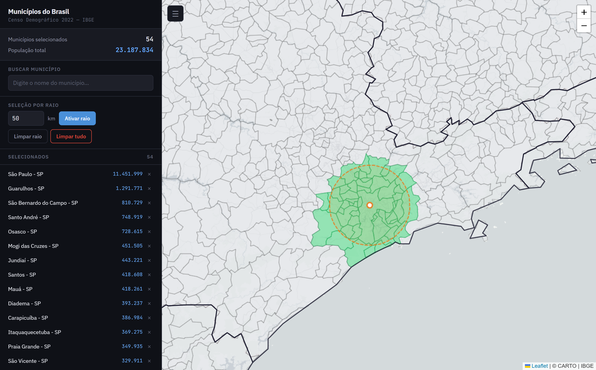

# GeoDemoBrasil — Plataforma de Análise Geodemográfica

Plataforma interativa de análise geodemográfica dos 5.570 municípios brasileiros com dados do Censo Demográfico 2022 (IBGE). Permite visualizar, comparar e exportar indicadores socioeconômicos por município ou região.



**[Demo ao vivo](https://luizfpb.github.io/mapa-municipios-brasil/)**

---

## Funcionalidades

- **Mapa coroplético interativo** com malha municipal completa (renderização via Canvas)
- **Camadas temáticas**: população, densidade, faixa etária, educação, renda, IDHM, urbanização
- **Busca por nome** com autocomplete e navegação por teclado
- **Seleção individual** por clique (toggle)
- **Seleção por raio** geográfico (1–2000 km) com interseção via Turf.js
- **Grupos de comparação** (A/B) com painel side-by-side e gráficos
- **Exportação** dos dados selecionados em CSV e Excel (.xlsx)
- **Painel de estatísticas** com contagem e população agregada
- **Limites estaduais** sobrepostos
- **Tooltips dinâmicos** com dados do tema ativo
- **Sidebar retrátil** e layout responsivo
- **Debug mode** via `Ctrl+Shift+D`

## Fontes de dados

| Dado | Fonte | Referência |
|------|-------|------------|
| Malha municipal | IBGE Malhas | [API v3](https://servicodados.ibge.gov.br/api/docs/malhas?versao=3) |
| Nomes dos municípios | IBGE Localidades | [API v1](https://servicodados.ibge.gov.br/api/docs/localidades) |
| População (Censo 2022) | IBGE SIDRA | [Tabela 9514](https://apisidra.ibge.gov.br/) |
| Limites estaduais | IBGE Malhas | [API v3](https://servicodados.ibge.gov.br/api/docs/malhas?versao=3) |
| IDHM | Atlas Brasil / PNUD | [Atlas Brasil](https://atlasbrasil.org.br/) |

## Stack

- **Frontend**: Vanilla JS (ES modules) + [Leaflet](https://leafletjs.com/) + [Chart.js](https://www.chartjs.org/)
- **Build**: [Vite](https://vitejs.dev/)
- **Geoespacial**: [TopoJSON](https://github.com/topojson/topojson) + [Turf.js](https://turfjs.org/)
- **Exportação**: [SheetJS](https://sheetjs.com/)
- **Pipeline de dados**: Python (requests)
- **Tiles**: [CARTO Basemaps](https://carto.com/basemaps)

## Setup

### Requisitos

- Node.js 18+
- Python 3.10+ (para o pipeline de dados)

### Instalação

```bash
git clone https://github.com/luizfpb/mapa-municipios-brasil
cd mapa-municipios-brasil
npm install
```

### Desenvolvimento

```bash
npm run dev
```

O servidor de desenvolvimento inicia em `http://localhost:3000`.

### Build de produção

```bash
npm run build
npm run preview   # Testar o build localmente
```

### Pipeline de dados (opcional)

Para gerar/atualizar os JSONs de dados temáticos:

```bash
cd scripts
pip install -r requirements.txt
python build_data.py
```

Flags disponíveis:
- `--skip-download`: pula o download e só processa dados existentes em `data/raw/`

## Estrutura do projeto

```
├── data/
│   ├── raw/              # Dados brutos (gitignored)
│   └── processed/        # JSONs prontos para o frontend
├── scripts/              # Pipeline Python de ETL
├── src/
│   ├── main.js           # Entry point
│   ├── map.js            # Leaflet init
│   ├── layers.js         # Renderização e eventos
│   ├── choropleth.js     # Escalas de cor e legenda
│   ├── data.js           # Carregamento de dados
│   ├── state.js          # Estado global reativo
│   ├── ui/               # Módulos de interface
│   ├── utils/            # Utilitários (fetch, format, debug)
│   └── styles/           # CSS modular
├── index.html
├── vite.config.js
└── package.json
```

## Licença

[MIT](LICENSE)
