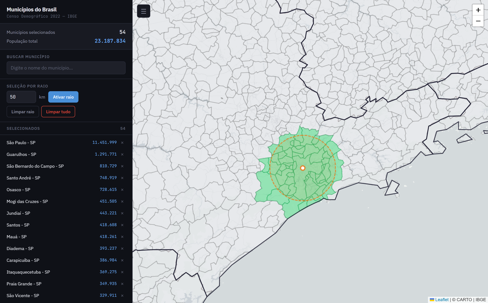

# Mapa Interativo dos Municípios do Brasil

Visualização interativa de todos os 5.570 municípios brasileiros com dados populacionais do Censo Demográfico 2022 (IBGE). Permite buscar, selecionar e analisar municípios individualmente ou por raio geográfico.

<!-- Substitua pelo link real do screenshot após hospedagem -->


**[Demo ao vivo](https://luizfpb.github.io/mapa-municipios-brasil/)**

---

## Funcionalidades

- **Mapa interativo** com malha municipal completa do Brasil (renderização via Canvas para performance)
- **Busca por nome** com autocomplete e destaque de correspondência
- **Seleção individual** de municípios por clique, com toggle
- **Seleção por raio** — define um ponto no mapa e seleciona automaticamente todos os municípios dentro de um raio configurável (1–2000 km)
- **Painel de estatísticas** com contagem de municípios selecionados e população total agregada
- **Lista de selecionados** ordenada por população, com navegação por clique e remoção individual
- **Limites estaduais** sobrepostos para referência visual
- **Tooltips dinâmicos** com nome e população ao passar o mouse
- **Sidebar retrátil** para uso em tela cheia
- **Barra de progresso** durante carregamento dos dados

## Fontes de dados

Todos os dados são carregados em tempo real diretamente das APIs do IBGE:

| Dado | Fonte | API |
|------|-------|-----|
| Malha municipal (geometrias) | IBGE Malhas | [API v3 – Malhas](https://servicodados.ibge.gov.br/api/docs/malhas?versao=3) |
| Nomes dos municípios | IBGE Localidades | [API v1 – Localidades](https://servicodados.ibge.gov.br/api/docs/localidades) |
| População (Censo 2022) | IBGE SIDRA | [Tabela 9514](https://apisidra.ibge.gov.br/) |
| Limites estaduais | IBGE Malhas | [API v3 – Malhas](https://servicodados.ibge.gov.br/api/docs/malhas?versao=3) |

## Stack

- [Leaflet](https://leafletjs.com/) — mapa interativo
- [TopoJSON](https://github.com/topojson/topojson) — parsing das malhas compactadas
- [Turf.js](https://turfjs.org/) — operações geoespaciais (círculo de raio, intersecção)
- [CARTO Basemaps](https://carto.com/basemaps) — tiles de fundo
- HTML/CSS/JS vanilla — sem frameworks, sem build step

## Como usar

### Online (GitHub Pages)

Acesse a [demo ao vivo](https://luizfpb.github.io/mapa-municipios-brasil/) — nenhuma instalação necessária.

### Local

```bash
git clone https://github.com/luizfpb/mapa-municipios-brasil
cd mapa-municipios-brasil
# Abra index.html no navegador, ou sirva com qualquer servidor HTTP:
python3 -m http.server 8000
```

> **Nota:** O aplicativo faz requisições às APIs do IBGE, então é necessária conexão com a internet.

### Debug

Pressione `Ctrl+Shift+D` para ativar/desativar o log de debug no canto inferior direito.

## Licença

[MIT](LICENSE)
